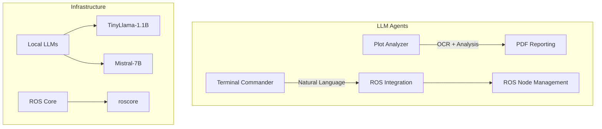

# Multi-Agent LLM System for Terminal & Scientific Analysis


A sophisticated multi-agent system combining natural language processing with ROS integration and scientific analysis capabilities, powered by optimized open-source LLMs from Hugging Face.

## System Architecture



## Agents Overview

### 1. Terminal Commander with ROS Integration
**File:** `terminal_commander.py`

#### Features:
- Natural language to terminal command translation
- ROS-specific command handling
- Automatic roscore management
- Terminal emulator detection (Linux/macOS/Windows)
- Command history and context awareness
- Safety checks for dangerous commands

#### Usage:
```bash
python3 terminal_commander.py
> start mission with exploration parameters
> launch rostopic list
> explain roslaunch package file.launch
```

### 2. Scientific Plot Analyzer
**File:** `plot_analyzer.py`

#### Features:
- High-precision OCR with image preprocessing
- Structured technical analysis template
- Quantitative metrics extraction
- Automated PDF report generation
- GPU-optimized inference

#### Usage:
```bash
python3 plot_analyzer.py scientific_plot.png --output analysis.pdf
```

## Technical Specifications

### Model Requirements

| Agent | Model | Size | VRAM | CPU RAM | Quantization |
|-------|-------|------|------|---------|--------------|
| Terminal Commander | TinyLlama-1.1B | ~0.8GB | 2GB | 4GB | Q4_K_M |
| Plot Analyzer | Mistral-7B | ~4.2GB | 6GB | 8GB | Q4_K_M |

### Performance Metrics

| Operation | Latency (CPU) | Throughput |
|-----------|---------------|------------|
| Command Translation | 0.8-1.2s | 12-15 req/min |
| Plot Analysis | 3-5s | 8-10 req/min |
| ROS Node Launch | Instant | N/A |

## Installation

### Prerequisites

```bash
# Base system
sudo apt install python3-pip tesseract-ocr poppler-utils

# Python requirements
pip install llama-cpp-python pillow pytesseract fpdf2 rospkg
```

### Model Download

```bash
# Terminal Commander model
wget https://huggingface.co/TheBloke/TinyLlama-1.1B-Chat-v1.0-GGUF/resolve/main/tinyllama-1.1b-chat-v1.0.Q4_K_M.gguf

# Plot Analyzer model
wget https://huggingface.co/TheBloke/Mistral-7B-Instruct-v0.1-GGUF/resolve/main/mistral-7b-instruct-v0.1.Q4_K_M.gguf
```

## Configuration

### Environment Variables

```bash
# For GPU acceleration
export CUDA_VISIBLE_DEVICES=0

# For ROS integration
export ROS_MASTER_URI=http://localhost:11311
```

### Runtime Options

| Parameter | Description | Default |
|-----------|-------------|---------|
| `--gpu_layers` | Number of layers to offload to GPU | 40 |
| `--n_threads` | CPU threads for inference | All available |
| `--temperature` | LLM creativity (0-1) | 0.2 |

## ROS Integration Guide

1. Start rosbridge server:
```bash
roslaunch rosbridge_server rosbridge_websocket.launch
```

2. Supported ROS Commands:
- Automatic roscore management
- ROS node launching
- Topic monitoring
- Parameter setting

## Safety Features

1. **Command Validation**:
   - Blocks dangerous shell patterns (rm -rf, chmod, etc.)
   - ROS command sandboxing

2. **Content Filtering**:
   - LLM output validation
   - Template enforcement

3. **Resource Limits**:
   - Memory constraints
   - Timeout handling

## Example Use Cases

### Autonomous Mission Control
```bash
> start exploration mission with 5 waypoints
[System] Launching ROS nodes for mission planning...
```

### Scientific Paper Analysis
```bash
python plot_analyzer.py research_figure.png --output paper_analysis.pdf
```

### Terminal Assistance
```bash
> how do I check ROS topics?
[Assistant] Running: rostopic list
```

## Troubleshooting

| Issue | Solution |
|-------|----------|
| Model loading fails | Verify GGUF file integrity |
| ROS connection issues | Check `roscore` is running |
| OCR inaccuracies | Preprocess images with PIL |
| GPU out of memory | Reduce `--gpu_layers` |

## License

MIT License - See [LICENSE](LICENSE) for details.

## Contributing

1. Fork the repository
2. Create feature branch (`git checkout -b feature/improvement`)
3. Commit changes (`git commit -am 'Add new feature'`)
4. Push to branch (`git push origin feature/improvement`)
5. Open Pull Request

---

**Note**: For production deployment, consider implementing additional security measures and monitoring for the LLM interactions.
